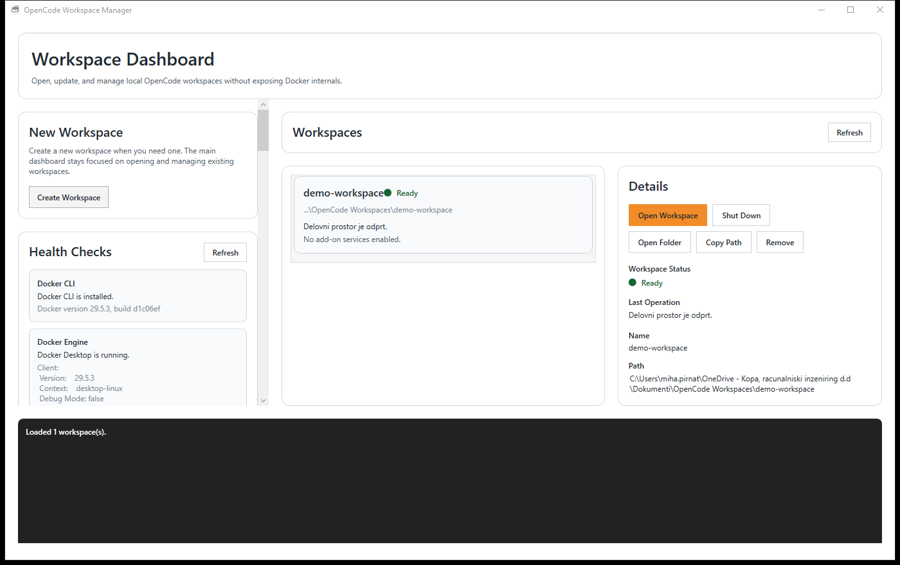
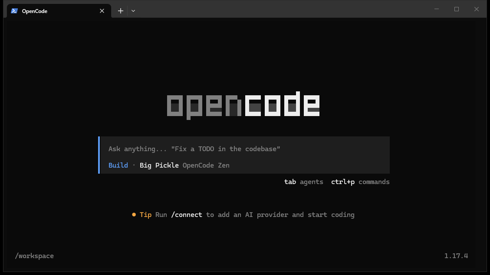

# opencode stuff

## What Is OpenCode Stuff?

OpenCode Stuff helps package tools, documentation, automation, and AI into reusable workspaces that can be opened on another machine with minimal setup.

A workspace is the durable body of work. A runtime is the replaceable tool environment. A session is the temporary execution where work happens.

Read more: [docs/philosophy.md](docs/philosophy.md)

## Screenshots

### Workspace Launcher

Create, open, protect, and manage durable workspaces.

### Runtime Environment

Disposable runtime environment attached to the workspace.

### Active Terminal Session

Temporary session inside the current runtime.

## Quick Start

1. Install prerequisites.
2. Configure Git credentials.
3. Create or open a workspace.
4. Start the runtime.
5. Start working.

Detailed setup:

- [Windows Setup](docs/windows-prerequisites.md)
- [First Workspace Guide](docs/first-workspace.md)

## Why Workspaces?

Workspaces help avoid repeated setup, package useful tools and knowledge, preserve work, and make onboarding easier.

The goal is to make work durable, reproducible, portable, and recoverable.

## Workspace / Runtime / Session

Workspace:

- durable body of work
- sources
- knowledge
- work
- artifacts
- history

Runtime:

- disposable tool environment
- tools
- automation
- AI capabilities
- MCP integrations

Session:

- temporary execution

Runtimes can change. Work should survive.

## Safety & Recovery

- Save Point protects local progress.
- Publish is explicit.
- Backup is optional but recommended.
- Restore favors recovery over overwrite.
- Timeline records key recovery and publish events.
- Working Copy is the normal place to make local changes safely.

Git is the persistence engine underneath.

The workspace provides the experience.

### Workspace Safety

- Save Points protect work.
- Backups protect against machine loss.
- Secrets are protected.
- Disposable files are ignored.
- Important work is preserved.

Your work is protected locally. Remote backup is optional but recommended.

## Documentation

- Windows Setup: [docs/windows-prerequisites.md](docs/windows-prerequisites.md)
- First Workspace Guide: [docs/first-workspace.md](docs/first-workspace.md)
- Fact Sheet: [docs/fact-sheet.md](docs/fact-sheet.md)
- Workspace Guide: [docs/workspace-yaml.md](docs/workspace-yaml.md)
- Runtime Guide: [docs/concepts/runtime.md](docs/concepts/runtime.md)
- Architecture: [docs/architecture.md](docs/architecture.md)
- Troubleshooting: [docs/troubleshooting.md](docs/troubleshooting.md)

## Learn More

For the reasoning behind the project and the Durable Workspace model, see [docs/philosophy.md](docs/philosophy.md).

- Philosophy: [docs/philosophy.md](docs/philosophy.md)
- Workspace Concepts: [docs/concepts/workspace.md](docs/concepts/workspace.md)
- Runtime Concepts: [docs/concepts/runtime.md](docs/concepts/runtime.md)
- Session Concepts: [docs/concepts/session.md](docs/concepts/session.md)
- Save Points: [docs/concepts/save-point.md](docs/concepts/save-point.md)
- Content Classification: [docs/concepts/content-classification.md](docs/concepts/content-classification.md)
- Fact Sheet: [docs/fact-sheet.md](docs/fact-sheet.md)
- Architecture: [docs/architecture.md](docs/architecture.md)
- Troubleshooting: [docs/troubleshooting.md](docs/troubleshooting.md)

## Philosophy

> There is no magic. Only stuff.
