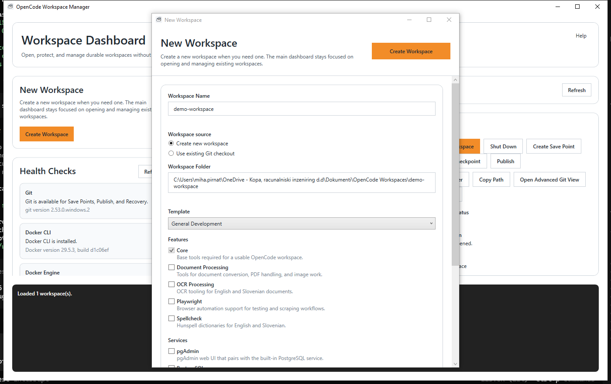
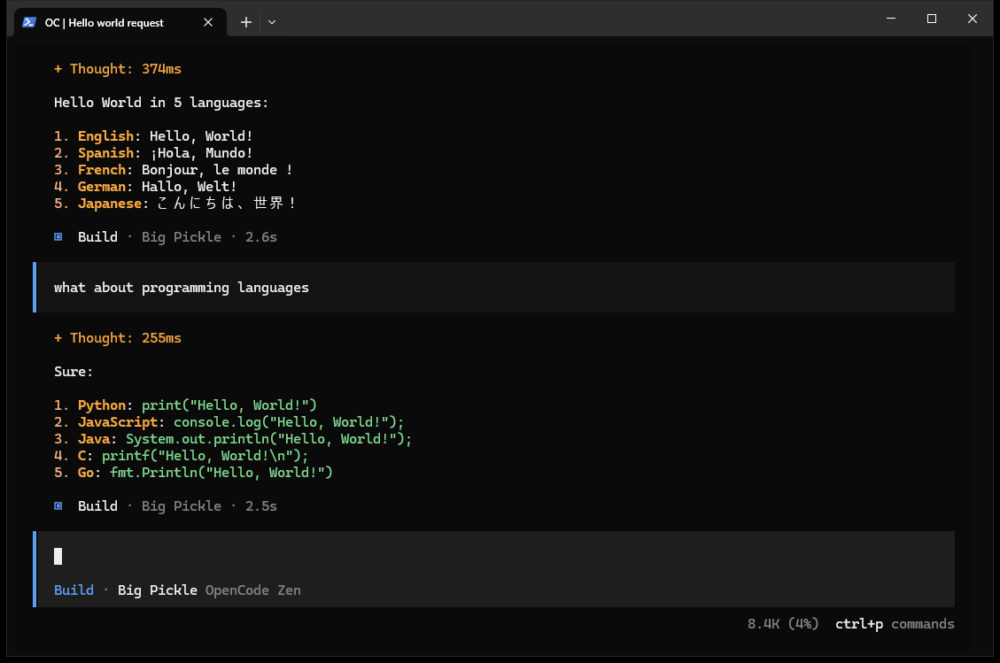

# opencode stuff

There is no magic. Only stuff.

Branding asset roles:

- `docs/images/opencode-stuff-satchel-transparent.png`: documentation and branding artwork for README, docs, onboarding, release notes, splash, and about surfaces
- `docs/images/opencode-stuff-satchel-icon.png`: canonical application icon source for Avalonia, Windows, Linux, macOS, taskbar, dock, installer, package, and favicon assets
- `docs/images/opencode-stuff-header-brand.png`: source header artwork
- `docs/images/opencode-stuff-header-brand-ui.png`: UI-ready Avalonia header asset derived from the source with an ImageMagick trim step

Generate icon sizes from `opencode-stuff-satchel-icon.png`. Do not redraw or reinterpret the icon for platform variants.
Generate the Avalonia header asset from `opencode-stuff-header-brand.png` with the ImageMagick trim pipeline rather than manual redraws. The source PNG is opaque, so the pipeline removes the light matte, keys out the connected dark banner background, shaves the residual banner edge, and then performs the final trim.

`opencode stuff` ships one desktop shell:

- `OpenCode Workspace Avalonia`: the Windows desktop application and the cross-platform shell for Windows, macOS, and Linux

## Desktop Shells

Current desktop split:

- `src/OpenCode.Workspace.Core/`: shared workspace/runtime/domain logic
- `src/OpenCode.Workspace.AppSupport/`: minimal shell-neutral app support
- `src/OpenCode.Workspace.Avalonia/`: cross-platform Avalonia shell and primary Windows desktop path
- `src/OpenCode.Workspace.Platform*/`: host-specific platform integrations

The Avalonia shell now covers the full Level A Windows workflow set:

- Create Workspace
- Open Existing Repository
- Start Workspace
- Recover Workspace
- Attach Workspace
- responsive workspace overview and background enrichment
- diagnostics and validation
- reprovision with immediate transcript feedback
- templates, transcripts, documentation links, and settings

The Avalonia shell also keeps the recent reliability and ownership guarantees:

- placeholder-first, non-blocking discovery
- background detail enrichment without list freezes
- repository-owned `workspace.yaml` / `workspace.yml` preservation during import
- shared Windows Terminal attach orchestration and diagnostics
- immediate transcript feedback for long-running operations

Use Avalonia as the default Windows desktop application.

## Desktop Status

Avalonia is the Windows workspace manager.

## OpenCode Workspace Manager

OpenCode Workspace Manager is the product name for durable workspaces, repository onboarding, and reusable development environments with disposable runtimes, local recovery, and safe Git-based working flows.



*Current main window showing workspace status, branch safety information, recovery state, and workspace management tools.*

The Avalonia desktop shell lets you work with AI agents in isolated, reproducible workspaces without risking your main branch or development environment.

Import an existing Git checkout, create a temporary workspace branch, work safely, and recover progress using Save Points and Checkpoints.

It is a workspace manager first, not a Docker launcher and not a single-template demo host.

## Existing Workspace Discovery

Templates are a starting point, not the long-term source of truth.

When a repository already contains workspace configuration, the desktop shells load that repository-owned configuration instead of starting from application defaults.

Supported repository configuration paths are:

- `workspace.yaml`
- `workspace.yml`
- `.opencode/profile.yaml`
- `.opencode/profile.yml`

That means a repository can carry its own onboarding experience through Git:

- `workspace.yaml`
- `AGENTS.md`
- `README.md`
- `docs/`
- tutorials
- scripts
- troubleshooting notes

Workflow:

```text
Template
    ↓
Create Workspace
    ↓
Customize
    ↓
Commit to Git
    ↓
Clone Repository
    ↓
Open Repository
    ↓
Workspace Discovered
```

The repository contains not only source code, but also the knowledge required to work with that source code.

Onboarding flow:

```text
Repository
    ↓
Workspace Discovery
    ↓
Provision Environment
    ↓
Read Documentation
    ↓
Start Working
```

The Oracle family below is one concrete example of that onboarding model. It is not a platform requirement for every repository.

## Inside The Workspace

OpenCode Workspace Manager creates and protects durable workspaces.

Once a workspace is opened, work happens inside an attached OpenCode session.


The runtime is disposable. The work is durable.

Durable workspace artifacts such as `workspace.yaml`, repository content, `AGENTS.md`, notes, docs, specs, tests, and reports remain the assets that matter most.

Generated runtime files such as `compose.yaml`, `.env`, attach wrappers, and provisioning scripts are replaceable infrastructure. Ephemeral runtime state such as containers, sessions, caches, and diagnostics is disposable.

Machine-local runtime resolution is stored under `.opencode/local/`, including `.opencode/local/runtime-state.yaml`. This folder is ignored by Git, regenerated automatically after successful runtime operations, not required for workspace discovery, and not intended for manual editing.

Generated runtime artifacts now include concise metadata headers so users can see which host/runtime decision produced the file, which target platform was resolved, and whether the result was native or fallback. The header is intentionally portable and excludes usernames, absolute paths, secrets, and machine identifiers.

Example:

```text
Generated by OpenCode Workspace Manager

Host OS: Linux
Host Architecture: x64

Runtime: docker
Target Platform: linux/amd64
Compatibility: native

Generated: 2026-06-20T12:34:56Z

Do not edit manually.
Re-run reprovision to regenerate.
```

`opencode validate-platform` can also write durable Markdown reports for CI artifacts, troubleshooting, or review notes:

```bash
opencode validate-platform --target linux/amd64 --output report.md
opencode validate-platform --target linux/arm64 --output report.md
```

Future tooling can use the default artifact convention under `artifacts/platform-validation/`, for example `artifacts/platform-validation/linux-arm64.md`.

## ARM64 Validation Troubleshooting

If platform validation reports:

```text
Container execution: Failed
exec /usr/bin/uname: exec format error
```

the local Docker environment cannot currently execute ARM64 containers.

Common causes:

- ARM64 emulation is not installed
- the active Buildx builder does not include `linux/arm64`
- QEMU or `binfmt` registration is missing

Try:

```bash
docker run --privileged --rm tonistiigi/binfmt --install arm64
docker buildx create --use --name multiarch
docker buildx inspect --bootstrap
docker buildx ls
```

Then verify runtime execution directly:

```bash
docker run --rm --platform linux/arm64 ubuntu:24.04 uname -m
```

Expected:

```text
aarch64
```

`Repair Runtime` repairs generated or runtime state. It does not restore durable user work. Full backup exports now include `backup-manifest.yaml` so users can see which content is durable, generated, or ephemeral.



**New here?**
Start with the visual walkthrough:

- [Quick Start Walkthrough](docs/walkthrough/quick-start.md)
- [Existing Git Checkout Workflow](docs/walkthrough/existing-git-checkout.md)

## Most Common Use Case

Already have a Git repository?

Import the checkout, create an isolated workspace branch, open a disposable runtime, and work without touching `main` or `release` branches.

-> [Existing Git Checkout Workflow](docs/walkthrough/existing-git-checkout.md)

## Oracle Family

Not every workspace starts with an existing Git repository.

The Oracle family shows how repository discovery, onboarding documentation, and reusable development environments work together:

```text
Oracle PL/SQL Demo
    ↓
Oracle APEX Demo
    ↓
Oracle APEXlang Demo
```

- Oracle PL/SQL Demo: Oracle onboarding foundation for learning SQLcl, schema objects, procedures, triggers, and local Oracle workflows safely.
- Oracle APEX Demo: browser-based Oracle application development with Oracle Database Free, ORDS, Oracle APEX, and SQLcl in a reproducible local environment.
- Oracle APEXlang Demo: source-controlled Oracle APEX workflow with export, validation, import, and team onboarding assets.

Start with Oracle PL/SQL Demo first, then continue into APEX, then APEXlang.

Many Oracle teams rely heavily on shared development or staging databases.

The Oracle family provides local environments where developers can learn, experiment, troubleshoot, and understand Oracle workflows without affecting shared systems.

These workspaces can be created in minutes, reset when needed, and reused as repeatable onboarding and practice environments.

Supporting tools and content include:

- Oracle Database Free
- Oracle APEX
- Oracle REST Data Services (ORDS)
- SQLcl
- SQL*Plus
- SQL Developer integration
- sample schema and data
- PL/SQL procedures and triggers
- guided tutorials and lifecycle docs
- AI-assisted PL/SQL explanation
- source-controlled APEX export/import assets

Developers can:

- learn Oracle tooling
- understand existing PL/SQL
- learn browser-based Oracle application development
- experiment with queries and schema changes
- review exported APEX artifacts in Git
- prototype ideas safely
- validate concepts before touching shared environments

The environment can be reset and recreated at any time.

Learn more:

- [Oracle PL/SQL Demo](docs/oracle-plsql-demo.md)
- [Oracle APEX Demo](docs/oracle-apex-demo.md)
- [Oracle APEXlang Demo](docs/oracle-apexlang-demo.md)
- [Oracle Lifecycle Workflows](docs/oracle-lifecycle-workflows.md)

## Featured Workspace: Analytics & Reporting

The Analytics & Reporting workspace is a complete environment for exploring data, building dashboards, generating reports, and learning modern Python-based analytical workflows.

It is designed for repository-first analytical work:

```text
Repository
    ↓
Workspace Discovery
    ↓
Provision Environment
    ↓
Read Documentation
    ↓
Start Working
```

Users should be able to provision a workspace and immediately begin working with:

- Marimo
- Pandas
- Excel
- CSV
- JSON
- Plotly
- Matplotlib
- statistics
- dashboards
- reports

This workspace exists so analysis can stay durable, explainable, and easy to revisit later.

Marimo notebooks are stored as normal Python files, analytical workflows stay Git-friendly, reports are reproducible, AI agents can participate naturally, and analytical assets become part of the repository instead of getting trapped in ad-hoc local tools.

Supporting assets include:

- sample datasets
- guided skills
- validation scripts
- knowledge packs

Recommended first experience:

```text
Create Analytics Workspace
    ↓
Provision Runtime
    ↓
Open Marimo
    ↓
Explore Sample Data
    ↓
Generate KPI Dashboard
    ↓
Export Report
```

This workspace is intended for:

- analysts
- developers
- consultants
- engineers
- students
- educators

Users do not need prior Python experience to begin.

OpenCode can help:

- generate analytical code
- explain analytical code
- create charts
- build reports
- troubleshoot workflows

Understanding the generated work remains important.

Learn more:

- [Analytics & Reporting Workspace](docs/analytics-workspace.md)
- [Analytics Capability](docs/capabilities/analytics.md)
- [Reporting Capability](docs/capabilities/reporting.md)
- [Analytics Agent Onboarding](docs/reference/agent-onboarding/analytics.md)

## Featured Workspace: Education & STEM

The Education & STEM workspace is one of the flagship examples of the platform.

Featured demo path:

```text
Education & STEM Demo
    ↓
Survey Analysis
    ↓
Probability Lab
    ↓
Climate Dashboard
    ↓
Machine Learning Intro
    ↓
Science Report
```

Its story is simple:

```text
Curiosity
    ↓
Exploration
    ↓
Project
    ↓
Understanding
```

It combines:

- Analytics & Reporting
- Education Knowledge Pack
- Sample Data Pack
- Skills
- AI-assisted learning
- Reproducible notebooks

The goal is to give students, teachers, parents, and self-learners an accessible place to ask questions, explore ideas, and turn those ideas into durable projects.

Typical topics include:

- mathematics
- statistics
- science
- engineering
- climate analysis
- surveys
- visualization
- introductory machine learning
- research projects
- technical writing

Students, teachers, parents, and self-learners can use the workspace to:

- ask questions
- generate experiments
- build charts
- explore datasets
- learn Python
- learn statistics
- learn scientific thinking

Example activities:

- Analyze a classroom survey.
- Create a climate dashboard.
- Visualize population data.
- Explore probability experiments.
- Build a simple machine-learning model.
- Generate a science report.

No prior Python experience is required to begin.

Python knowledge remains valuable.

AI should be treated as a tutor and assistant rather than a replacement for learning.

The goal is to make modern analytical and scientific tools more accessible while keeping the repository as the durable source of notes, code, reports, prompts, and explanation.

Learn more:

- [Education & STEM Demo](docs/education-stem-demo.md)
- [Education & STEM Workspace](docs/education-stem-workspace.md)
- [Education Knowledge Pack](docs/features/education-knowledge-pack.md)
- [Education Agent Onboarding](docs/reference/agent-onboarding/education.md)
- [Analytics Agent Onboarding](docs/reference/agent-onboarding/analytics.md)

## Acknowledgements

Several ideas behind the Analytics & Reporting and Education & STEM experiences were inspired by the excellent presentation:

`The Trick That Makes Open LLMs Viable for Python`
<https://www.youtube.com/watch?v=ZBI7BDUK1Es>

OpenCode Workspace Manager is not affiliated with the author.

The project is grateful for the ideas demonstrated in the presentation and recommends it as one of the clearest introductions to:

- AI-assisted analytics
- reproducible workflows
- Git-friendly notebooks
- Python-first exploration
- modern educational analytics

The Analytics & Reporting and Education & STEM workspaces were influenced by many of these principles.

Thank you for helping demonstrate what modern AI-assisted analytical workflows can look like.

## Featured Workspace: Documentation Features

The Documentation Features workspace is a ready-to-run report and publishing environment for teams that need reliable PDF output, diagrams, validation, and broad Windows-compatible font coverage inside Ubuntu workspaces.

Included tooling covers:

- Markdown to PDF with `pandoc` and `typst`
- HTML to PDF with `weasyprint`
- Mermaid, Graphviz, and PlantUML diagrams
- PDF inspection with `pdfinfo`, `pypdf`, and `pymupdf`
- Report generation with `reportlab`
- Python 3 tooling with both `python` and `python3` commands available for compatibility
- multilingual and business-document fonts including Carlito, Caladea, Liberation, Noto, Inter, Roboto, JetBrains Mono, Fira Code, and optional Microsoft-compatible core fonts

Each generated workspace also includes validation and demo scripts so the toolchain can be checked immediately after provisioning.

**Learn more:** [Documentation Features Workspace](docs/documentation-features.md)

## Who Is This For?

- developers using AI coding agents
- teams experimenting on existing repositories
- projects requiring reproducible environments
- users who want local-first recovery before cloud backup

## What It Does

OpenCode Stuff packages tools, documentation, automation, and AI into reusable workspaces that can be opened on another machine with minimal setup.

A workspace is the durable body of work. A runtime is the replaceable tool environment. A session is the temporary execution where work happens.

The product model is:

- durable workspaces
- repository onboarding
- reusable development environments

Recommended for existing projects: use the [Existing Git Checkout Workflow](docs/walkthrough/existing-git-checkout.md) to create an isolated workspace branch instead of working directly on `main`.

## Features

- durable workspaces with disposable runtimes
- safe local recovery with Save Points and Checkpoints
- explicit Publish to remote backup flow
- existing Git checkout workflow with isolated workspace branches
- safety status that shows branch risk, local changes, and backup state

## Installation

1. Install prerequisites.
2. Configure Git credentials.
3. Create or open a workspace.
4. Start the runtime.
5. Start working.

Detailed setup:

- [Windows Setup](docs/windows-prerequisites.md)
- [First Workspace Guide](docs/first-workspace.md)

## Configuration

1. Open OpenCode Workspace Manager.
2. If the quick tutorial prompt appears, start it for a short walkthrough.
3. Create a workspace with a clear name and keep your files inside that workspace folder.
4. Open the workspace from the list or by double-clicking it.
5. Open Workspace resumes the latest OpenCode session when one exists. If no OpenCode session exists, a new one is started.
6. Create a Save Point before a big change, create another after a good state, and Publish to remote backup only when you want off-machine backup.

## Typical Workflow

1. Import an existing Git repository.
2. Create an isolated workspace branch.
3. Open a disposable runtime.
4. Work with AI agents.
5. Create Save Points during important milestones.
6. Merge, publish, archive, or discard changes when finished.

## Workspace / Runtime / Session

- workspace: durable body of work
- runtime: disposable tool environment
- session: temporary execution inside the runtime

## Development

Development is centered on durable workspaces, disposable runtimes, and repeatable setup.

Canonical developer rebuild/run command:

```powershell
scripts/rebuild-and-run.ps1 -Configuration Debug
```

Node.js 22 LTS is the default runtime baseline for new workspaces.

Why: recent documentation, analytics, visualization, browser automation, diagram generation, MCP tooling, and AI-adjacent npm packages increasingly target Node 20+ and Node 22 LTS. Using Node 22 reduces engine warnings and compatibility drift across workspace templates.

## Safety & Recovery

- Save Point protects local progress.
- Publish is explicit.
- Backup is optional but recommended.
- Restore favors recovery over overwrite.
- Timeline records key recovery and publish events.
- Working Copy is the normal place to make local changes safely.

Git is the persistence engine underneath.

The workspace provides the experience.

### Workspace Safety

- Save Points protect work.
- Backups protect against machine loss.
- Secrets are protected.
- Disposable files are ignored.
- Important work is preserved.

Your work is protected locally. Remote backup is optional but recommended.

## Architecture

Git is the persistence engine underneath. The workspace provides the experience.

Read more:

- [Architecture](docs/architecture.md)
- [Philosophy](docs/philosophy.md)
- [Design Principles](docs/design-principles.md)
- [Workspace Guide](docs/workspace-yaml.md)
- [Runtime Guide](docs/concepts/runtime.md)

## Documentation

### Getting Started

- [Quick Start Walkthrough](docs/walkthrough/quick-start.md)
- [Existing Git Checkout Workflow](docs/walkthrough/existing-git-checkout.md)
- [Windows Setup](docs/windows-prerequisites.md)
- [First Workspace Guide](docs/first-workspace.md)

### Concepts

- [Workspace](docs/concepts/workspace.md)
- [Runtime](docs/concepts/runtime.md)
- [Session](docs/concepts/session.md)
- [Save Points](docs/concepts/save-point.md)

### Reference

- [Philosophy](docs/philosophy.md)
- [Design Principles](docs/design-principles.md)
- [Architecture](docs/architecture.md)
- [Workspace YAML](docs/workspace-yaml.md)
- [Troubleshooting](docs/troubleshooting.md)
- [Fact Sheet](docs/fact-sheet.md)
- [Oracle PL/SQL Demo](docs/oracle-plsql-demo.md)
- [Oracle APEX Demo](docs/oracle-apex-demo.md)
- [Oracle APEXlang Demo](docs/oracle-apexlang-demo.md)
- [Oracle Lifecycle Workflows](docs/oracle-lifecycle-workflows.md)
- [Team Onboarding](docs/team-onboarding.md)
- [Sharing Oracle Workspaces](docs/sharing-oracle-workspaces.md)

### Onboarding Guidance

- [Existing Workspace Discovery](#existing-workspace-discovery)
- [Philosophy](docs/philosophy.md)
- [Design Principles](docs/design-principles.md)
- [Workspace YAML](docs/workspace-yaml.md)
- [AGENTS.md Guide](docs/agents-guide.md)
- [AGENTS.md](AGENTS.md)

## Learn More

For the reasoning behind the project and the Durable Workspace model, see [docs/philosophy.md](docs/philosophy.md).

- Philosophy: [docs/philosophy.md](docs/philosophy.md)
- Design Principles: [docs/design-principles.md](docs/design-principles.md)
- Workspace Concepts: [docs/concepts/workspace.md](docs/concepts/workspace.md)
- Runtime Concepts: [docs/concepts/runtime.md](docs/concepts/runtime.md)
- Session Concepts: [docs/concepts/session.md](docs/concepts/session.md)
- Save Points: [docs/concepts/save-point.md](docs/concepts/save-point.md)
- Content Classification: [docs/concepts/content-classification.md](docs/concepts/content-classification.md)
- Fact Sheet: [docs/fact-sheet.md](docs/fact-sheet.md)

## Philosophy

> There is no magic. Only stuff.
