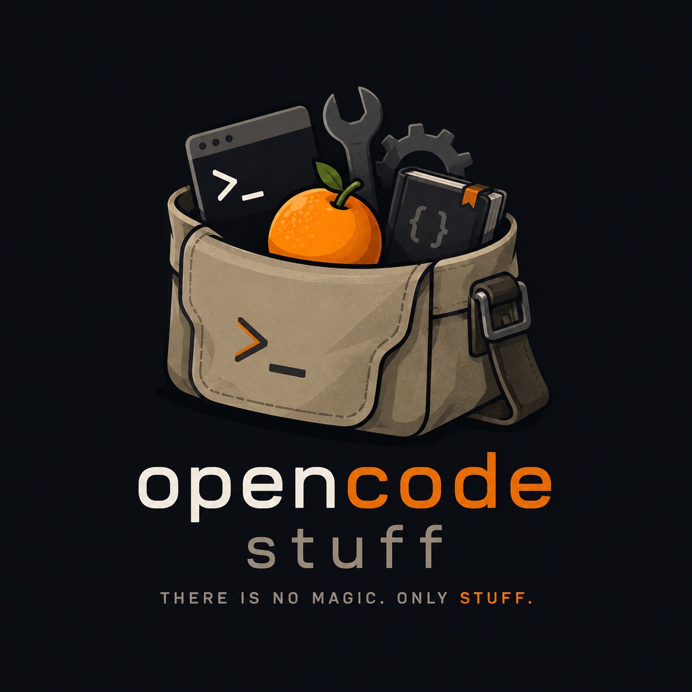

# opencode stuff

OpenCode Stuff makes workspaces portable.

Package tools, services, knowledge, automation, and AI into a reusable workspace that can be recreated, shared, and reopened whenever you need it.

Windows is currently the primary supported host platform. Workspaces run in reproducible Ubuntu environments powered by Docker, WSL2, and OpenCode.

## Mission

Make workspaces portable.

Instead of manually recreating tools, services, configuration, and project knowledge, define them once in a workspace and reopen them whenever you need them. Workspaces can be recreated, shared, versioned, and eventually promoted to hosted environments.

OpenCode Stuff focuses on local workspaces today. The same workspace model is intended to support shared and hosted environments in the future.

> There is no magic. Only stuff.

## Screenshots

### Launcher

Current desktop launcher for creating, opening, updating, and removing workspaces on Windows.

### Terminal Environment

OpenCode running inside the current Ubuntu and Docker-backed workspace environment.

### Current Terminal Session

Current Windows Terminal session with the latest workspace environment and terminal configuration.

## Quick Start

1. Read the Windows setup guide: [docs/windows-prerequisites.md](docs/windows-prerequisites.md)
2. Install prerequisites.
3. Verify Docker and Ubuntu integration.
4. Create a workspace.
5. Open the workspace.
6. Start working.

Primary entry point for new users:

- Windows Setup Guide: [docs/windows-prerequisites.md](docs/windows-prerequisites.md)

## What is this?

This repository contains practical tools, skills, workflows, workspace utilities, and experiments built around OpenCode.

In practical terms, it is focused on:

- a Windows workspace launcher
- Ubuntu and WSL2 integration
- Docker-based workspaces
- OpenCode workspaces
- local development productivity
- skills and automation
- documentation-driven workflows
- reproducible development environments

The goal is to make environments portable, repeatable, and easy to bootstrap.

## Why workspaces exist

Setting up development environments repeatedly is wasteful.

Tools, documentation, automation, prompts, configuration, and validation logic are often recreated on every machine.

A workspace packages those pieces into a reusable unit so you can start from a known state instead of rebuilding the environment from scratch.

## Workspace Model

A workspace packages the things needed to work effectively into a reusable unit:

- Tools
- Documentation
- Skills
- Automation
- Configuration
- Validation

The intent is that a developer can open a workspace and become productive immediately.

Over time, the same workspace definition should be reusable across:

- local Docker environments
- shared development servers
- remote Linux machines
- cloud-hosted workspaces

while keeping the same logical structure.

## Documentation

- Windows Setup Guide: [docs/windows-prerequisites.md](docs/windows-prerequisites.md)
- Architecture: [docs/architecture.md](docs/architecture.md)
- Workspace Guide: [docs/workspace-yaml.md](docs/workspace-yaml.md)
- Skills and Catalogs: [docs/catalogs.md](docs/catalogs.md)
- Troubleshooting: [docs/troubleshooting.md](docs/troubleshooting.md)

## Philosophy

The project prefers explicit tools, readable configuration, repeatable workflows, and useful automation over hidden behavior.
