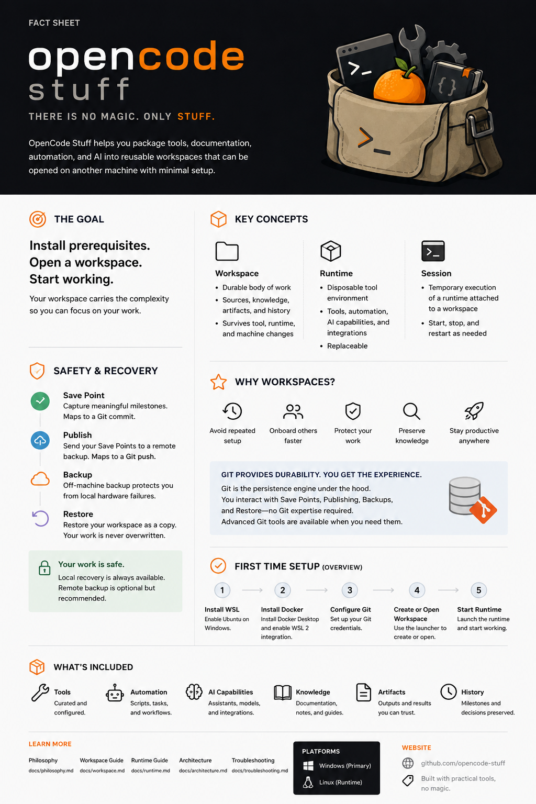

# OpenCode Stuff Fact Sheet

This page and the fact-sheet image should stay synchronized.

When the durable workspace model changes, review both the image and the markdown summary together.

## Goal

OpenCode Stuff helps package tools, documentation, automation, and AI into reusable workspaces that can be opened on another machine with minimal setup.

The practical goal is simple:

1. install prerequisites
2. open a workspace
3. start working

On Windows, the desktop application is the Avalonia shell.

## Key Concepts

### Workspace

A workspace is the durable body of work.

It can contain:

- sources
- knowledge
- work
- artifacts
- history

The workspace is intended to survive runtime replacement, tool upgrades, machine changes, and AI model changes.

### Runtime

A runtime is the replaceable tool environment.

It provides:

- tools
- automation
- AI capabilities
- MCP integrations

### Session

A session is the temporary execution of a runtime attached to a workspace.

Sessions can start, stop, restart, and be replaced without becoming the durable home of the work.

## Safety & Recovery

### Save Point

A Save Point is a user-facing recovery milestone.

It captures meaningful local progress and is backed by Git internally.

### Publish

Publish is the explicit backup and synchronization action.

Nothing is published automatically.

Normal users Publish from a Working Copy, not from a protected mainline branch.

### Backup

Remote backup protects against machine loss.

It is recommended, but local-only workspaces are still valid.

### Restore

Restore favors recovery over overwrite.

The default behavior is to restore as a new copy.

Workspace Safety:

- Save Points
- Backup awareness
- secret protection
- recovery-first design
- hidden content review
- durable artifact preservation

## Why Workspaces

Workspaces help people:

- avoid repeated setup
- onboard others faster
- preserve sources, decisions, and artifacts
- protect work
- stay productive
- reproduce useful environments

Instead of rebuilding tools, documentation, automation, and workflows on every machine, package them once and reuse them.

## First-Time Setup

The intended first-use flow is:

1. install WSL
2. install Docker Desktop
3. configure Git credentials
4. launch the Avalonia desktop app
5. create or open a workspace
6. start a runtime
7. start working

## What's Included

Depending on the workspace, OpenCode Stuff can package:

- curated tools
- automation and workflows
- AI capabilities and integrations
- documentation and notes
- generated artifacts and reports
- Save Points, checkpoints, and recovery history
- timeline events for local recovery and publish activity

## Philosophy

Git provides the persistence engine.

The workspace provides the user experience.

The project is built on a practical rule:

> Conflict is not failure. Lost work is failure.

And its broader theme remains:

> There is no magic. Only stuff.

The practical extension of that theme is documented in [Philosophy](philosophy.md) and [Design Principles](design-principles.md): software may feel magical, but the repository, specifications, documentation, tests, Save Points, and recovery workflows must keep that magic inspectable and auditable.

The same philosophy also treats diagrams, onboarding guides, tests, and validation as visible maps that make complexity navigable and understanding portable.

## Usage

This fact sheet is intended for:

- demos
- onboarding
- presentations
- executive overviews
