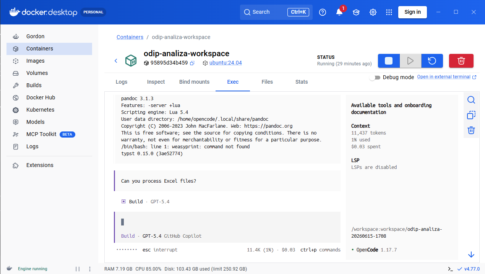

# Workspace Sessions Troubleshooting

Use this guide when the workspace starts but you are not yet in a usable OpenCode session.

## Using Docker Desktop Exec

Docker Desktop Exec is a valid way to access a workspace.

Users may be attached to:

- root shell
- opencode user shell
- OpenCode session

OpenCode sessions provide the best onboarding experience.

## Example

This screenshot captures a real Docker Desktop Exec session where capability discovery worked, but the shell context and installed-tool state still needed to be explained clearly.



## I only see a root shell

Symptoms:

```text
root@container:/#
```

Resolution:

```bash
su opencode
cd /workspace
opencode -s resume
```

## opencode command not found

Possible causes:

- wrong user
- PATH issue
- provisioning incomplete

Recovery steps:

1. switch to `opencode` with `su opencode`
2. verify provisioning completed
3. use `Prepare Workspace` or `Repair Runtime` if `opencode` is still unavailable

## No sessions available

Possible causes:

- workspace never initialized
- session removed
- provisioning failed

Recovery steps:

1. run `opencode sessions`
2. verify the workspace was provisioned successfully
3. use `Repair Runtime`, then `Prepare Workspace` if provisioning was incomplete

## Cannot attach to session

Diagnostics:

```bash
opencode sessions
```

Recovery steps:

1. confirm you are running as `opencode`
2. confirm the current directory is `/workspace`
3. retry `opencode -s resume` or `opencode -s <session-id>`
4. review workspace diagnostics and provisioning logs

## Workspace starts but agent is not running

Investigation steps:

1. verify the workspace is provisioned
2. verify `opencode sessions` shows a restorable session
3. reopen the session with `opencode -s resume`
4. run `Prepare Workspace` if the runtime or agent bootstrap was incomplete

## Capability catalog missing

Expected files:

```text
docs/capabilities/README.md
```

Recovery:

- run `Repair Runtime`
- regenerate documentation

## AGENTS.md missing or outdated

Recovery:

- run `Repair Runtime`
- verify generated blocks

## Tool mentioned in docs but not installed

Example symptom:

```text
weasyprint: command not found
```

Resolution:

1. verify capability catalog
2. verify installed tooling
3. review workspace feature configuration
4. run `Prepare Workspace` if the generated install plan needs to run again

The capability catalog is intended to answer questions such as `Can I process Excel files?`, `What PDF tools are available?`, `What OCR tools are available?`, `What Oracle tooling exists?`, and `What onboarding materials are available?` without repository-wide searching.

Agents should not claim a tool exists merely because documentation mentions it.

Full snapshot exports now include `backup-manifest.yaml` so durable, generated, and ephemeral content can be understood outside the running tool.
