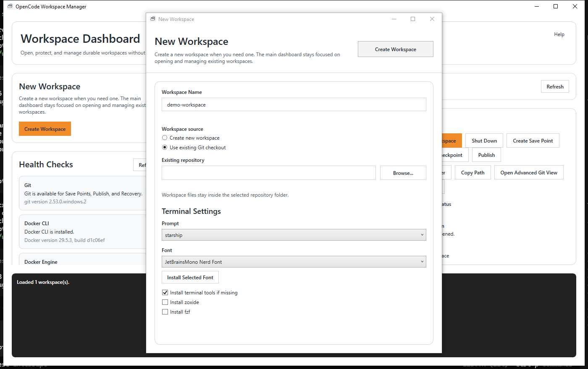
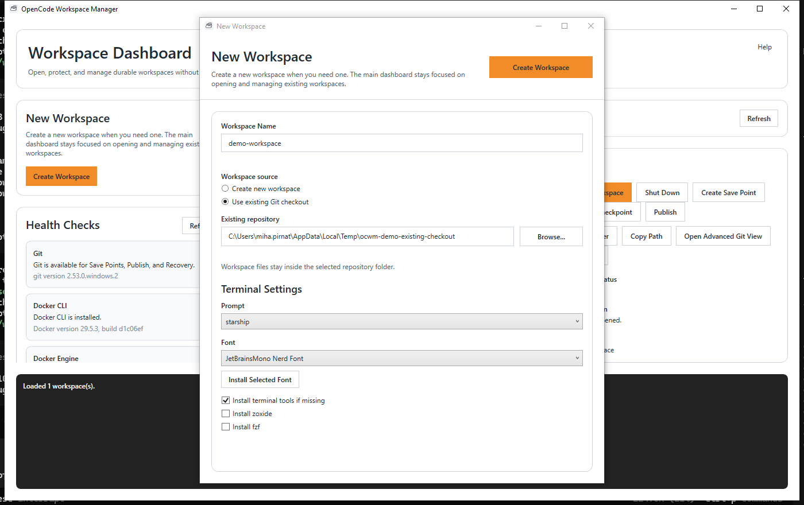
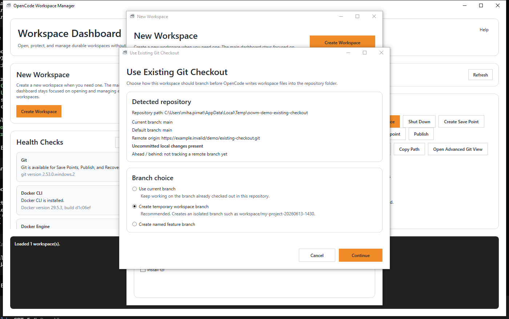
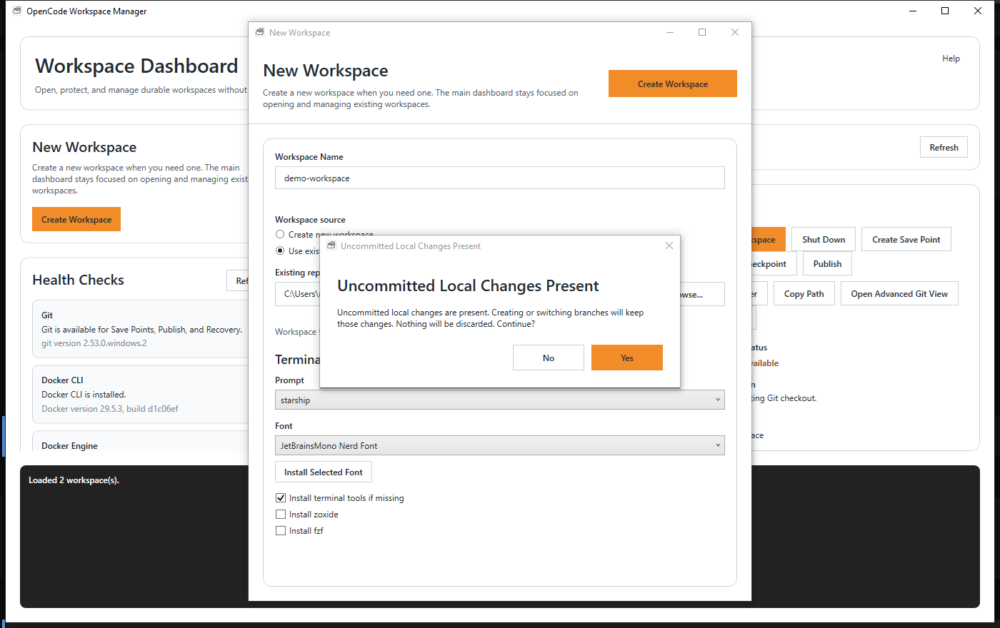
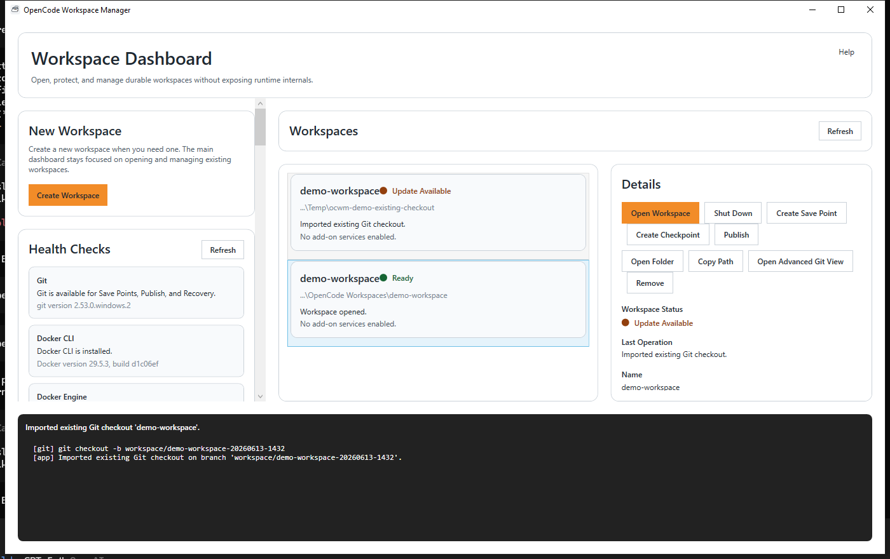
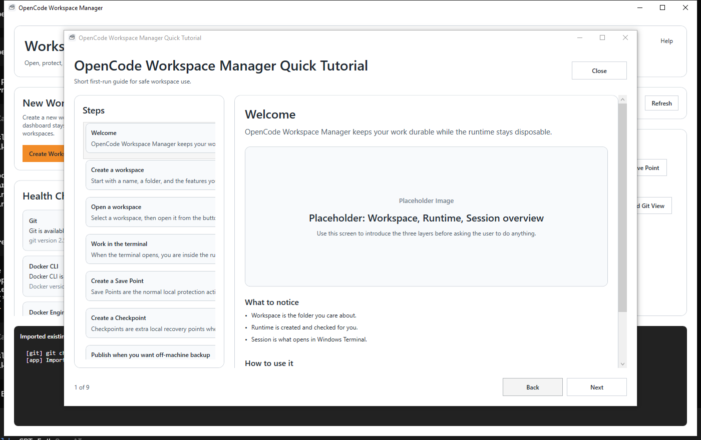

# Use With An Existing Git Checkout

Use this workflow when you already have a project checked out locally and want OpenCode Workspace Manager to work there safely.

## Why Use This Workflow

- safest way to let OpenCode or agents work on an existing project
- avoids direct changes on `main`, `master`, or `release/*` by default
- keeps the repository path explicit and visible in the app

## Select Existing Checkout

Choose `Create Workspace`, then switch the source to `Use existing Git checkout` and pick the repository folder.

## Repository Detected

The app inspects the selected folder and shows:

- current branch
- default branch when detectable
- remote origin URL if present
- whether local changes are still uncommitted
- ahead/behind if tracking data is available

## Choose Branch Strategy

The app asks how to work in that repository:

- `Use current branch`
- `Create temporary workspace branch`
- `Create named feature branch`

## Recommended Path

The recommended path is `Create temporary workspace branch`.

Example branch name:

- `workspace/my-project-20260613-1430`

If that branch name already exists, the app appends a numeric suffix instead of overwriting anything.

If the repository is dirty, the app warns before branch creation or switching and makes it clear that it will not discard your changes.

## Working Safely

After import, the main workspace details show where you are working.

Look for:

- repository path
- current branch
- default branch
- remote origin
- dirty working tree status
- branch status

The safety panel uses short wording:

- `Working on isolated workspace branch`
- `Working directly on protected branch`
- `Uncommitted local changes present`

## Returning Later

When you reopen the imported workspace later:

- the app refreshes Git status from the repository
- the current branch is shown as it really is at that moment
- the app does not silently switch branches

## Finishing Work

This workflow does not replace normal Git review or merge steps.

After you finish, you can:

- merge manually
- cherry-pick manually
- open a PR manually
- delete the temporary branch manually

The app helps you work safely inside the checkout, but it does not pretend to replace Git review.

## Help And Tutorial

The app keeps the quick tutorial available from the Help menu.

